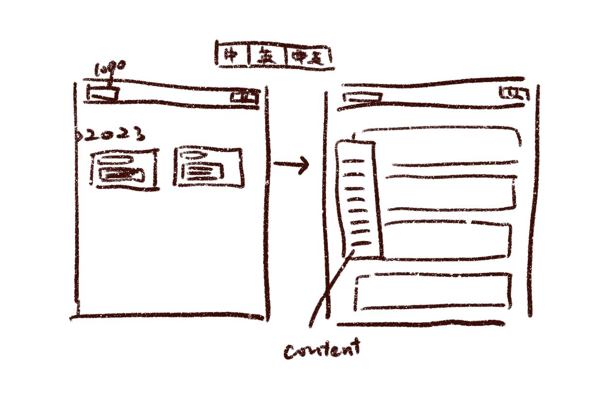

# novel-translation

- [x] 中英双文：一段中文，一段英文，可以切换。

  

- [ ] 目录、章节
- [ ] 返回顶端
- [ ] ~~调整字体、字体大小~~

## 翻译列表

- [ ] 狂人日记

## 注意

使用 GitHub Pages 构建时：

1. 不能直接 `import` 进小说文档，而要使用 `fetch`
2. utf-8 要转换成 utf-8 with bom 格式，以防止中文乱码
3. 服务器应该是 Linux，所以会用 `\n\n` 而不是 `\r\n` 来分段

## 工具

- [element-plus](https://element-plus.gitee.io/zh-CN/)
- [Bootstrap Icons](https://icons.getbootstrap.com/)
- [vite](https://cn.vitejs.dev/)
